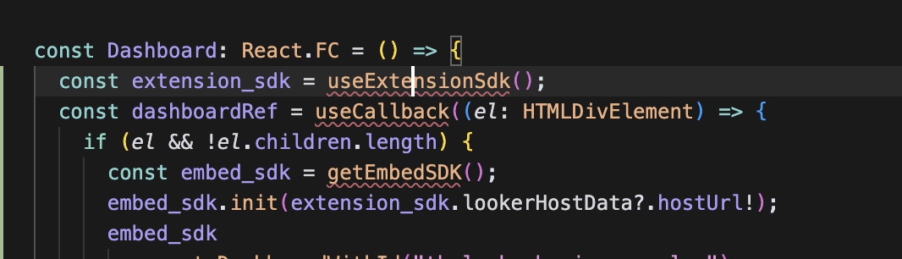

# Introduction to Extensions + React

To get started on this section, run `git checkout section1-start --force`, to jump to the end of this section, run `git checkout section1-end --force`

## Overview
- Introduction to application manifest and entitlements
- Embed a dashboard
- Saving the dashboard state and filters

## Items to Teach

- Importing packages
- Typescript interfaces
- React APIs
  - Passing props to components
  - useState
  - React Context
  - useCallback
- @looker/embed-sdk
  - building the url
  - on for javascript events
  - the .then and dashboard state
- Adding embed entitlements

# Introduction to application manifest and entitlements

In order for your extension to be able to embed a dashboard, you need to add the `use_iframes` and `use_embeds` entitlements to your manifest.lkml file

```lkml
application: simple_extension {
  label: "Simple Extension"
  url: "<serveo-url>/bundle.js"
  entitlements: {
    core_api_methods: ["me"]
    use_embeds: yes
    use_iframes: yes
  }
}

## What is the Looker Project Manifest?

The **Looker project manifest** is a special configuration file (typically named `manifest.lkml`) that defines project-wide settings, dependencies, and applications (extensions) for your Looker project. It acts as the central place to declare:
- Project metadata
- Dependencies on other LookML projects
- Constants and localization settings
- Applications (extensions) and their configuration

The manifest is essential for enabling and configuring Looker Extensions, which are custom applications that run inside the Looker platform. By defining an application in the manifest, you make it available to users in the Looker UI, and you can control where and how it appears.

For more details, see the [Looker Project Manifest documentation](https://cloud.google.com/looker/docs/reference/param-project-manifest).

## Defining an Application in the Manifest

To add an extension or application, use the `application` parameter in your `manifest.lkml` file. Here's a basic example:

```lkml
application: my_extension {
  label: "My Extension"
  url: "http://localhost:8080/bundle.js"  # For development
  # file: "apps/bundle.js"                # For production (after uploading)
  entitlements: {
    local_storage: yes
    navigation: yes
    new_window: yes
    use_embeds: yes
    core_api_methods: ["run_inline_query", "all_lookml_models"]
    external_api_urls: ["https://api.example.com"]
  }
}
```

- Use `url` for development (points to your local dev server)
- Use `file` for production (points to a static JS file in your project)
- The `entitlements` block controls what your extension is allowed to do

## What are Entitlements?

**Entitlements** are permissions that specify what capabilities your Looker extension or application is allowed to use. They are defined in the `entitlements` block of the application configuration in the manifest. This helps ensure security and proper isolation between extensions and the Looker platform.

### Common Entitlements

| Entitlement              | Description                                                                                 |
|-------------------------|---------------------------------------------------------------------------------------------|
| `local_storage`         | Allow use of browser local storage                                                          |
| `navigation`            | Allow navigation to different Looker pages                                                  |
| `new_window`            | Allow opening new browser windows or tabs                                                   |
| `use_embeds`            | Allow use of the Looker Embed SDK                                                           |
| `use_downloads`         | Allow downloading files (added in Looker 21.6)                                              |
| `use_iframes`           | Allow creating iframes (added in Looker 21.6)                                               |
| `use_clipboard`         | Allow writing to the system clipboard (added in Looker 21.8)                                |
| `core_api_methods`      | List of Looker API methods the extension can use                                            |
| `external_api_urls`     | List of external API URLs the extension can access directly                                 |
| `oauth2_urls`           | List of OAuth2 authentication URLs the extension can use                                    |
| `global_user_attributes`| List of global user attributes the extension can access                                      |
| `scoped_user_attributes`| List of extension-specific user attributes the extension can access                          |

For a full list and detailed descriptions, see the [Looker entitlements documentation](https://cloud.google.com/looker/docs/reference/param-manifest-application#entitlements).

### Example: Entitlements Block

```lkml
entitlements: {
  local_storage: yes
  navigation: yes
  new_window: yes
  use_embeds: yes
  core_api_methods: ["run_inline_query", "all_lookml_models"]
  external_api_urls: ["https://api.example.com"]
}
```

- Only the entitlements you specify are granted to your extension.
- If your extension tries to use a capability not listed, it will be blocked by Looker.

### Best Practices
- **Grant only the entitlements your extension needs** for its functionality.
- **Review and update entitlements** as your extension evolves.
- **Test your extension** in both development (`url`) and production (`file`) modes to ensure entitlements are set correctly.

## Further Reading
- [Looker Project Manifest documentation](https://cloud.google.com/looker/docs/reference/param-project-manifest)
- [Looker Application parameter reference](https://cloud.google.com/looker/docs/reference/param-manifest-application)
- [Looker Extension Framework Overview](https://cloud.google.com/looker/docs/extension-framework)


# Embed a dashboard

1. Open up the [Dashboard.tsx](../src/Dashboard.tsx) file.
2. Update the Dashboard component to the following

```tsx
const Dashboard: React.FC = () => {
  const dashboardRef = useCallback((el: HTMLDivElement) => {
    if (el && !el.children.length) {
      const embed_sdk = getEmbedSDK();
      embed_sdk.init(extension_sdk.lookerHostData?.hostUrl!);
      embed_sdk
        .createDashboardWithId("thelook::business_pulse")
        .appendTo(el)
        .build()
        .connect()
        .catch((error: any) => {
          console.error("Error embedding dashboard:", error);
        });
    }
  }, []);

  return (
    <StyledCard p="xsmall" raised borderRadius="large" ref={dashboardRef} />
  );
};
```

3. You should see some errors in your IDE that look like this:

4. Resolve the imports by adding the following to the top of the file:

```tsx
import { getEmbedSDK } from "@looker/embed-sdk";
import useExtensionSdk from "./hooks/useExtensionSdk";
import { useCallback } from "react";
```


## Importing packages

In JavaScript, **importing packages** means bringing in external code libraries or modules into your project so you can use their features and functionality. Packages are collections of reusable code—such as functions, classes, or entire frameworks—that help you avoid reinventing the wheel and speed up development.

### Why import packages?
- **Reuse existing solutions:** Instead of writing everything from scratch, you can use well-tested code written by others.
- **Add new features easily:** Packages provide ready-made tools for things like UI components, data fetching, authentication, and more.
- **Maintain cleaner code:** By splitting code into modules and importing only what you need, your codebase stays organized and manageable.
- **Stay up to date:** Popular packages are often updated to fix bugs and add features, so you benefit from ongoing improvements.

### How do you import packages?
In modern JavaScript (ES6+), you typically use the `import` statement:

```js
import React from 'react';
import { useState } from 'react';
import { EmbedSDK } from '@looker/embed-sdk';
```

This tells your project to include the specified package or module, making its exports available for use in your code.

> **Note:** Before you can import a package, you usually need to install it using a package manager like `npm` or `yarn` (e.g., `npm install react`). We've done all that for you already throughout this tutorial

## What is npm?

**npm** (Node Package Manager) is the default package manager for JavaScript projects using Node.js. It allows you to easily install, update, and manage external libraries (called packages) that your project depends on. With npm, you can:
- Download and install packages from the [npm registry](https://www.npmjs.com/)
- Manage your project's dependencies in a single file (`package.json`)
- Run scripts for building, testing, and running your app

## The `package.json` file

The [`package.json`](../package.json) file is the heart of any React, Javascript, or Node.js project. It lists all the packages (dependencies) your project needs, along with scripts and metadata. You can view your project's `package.json` [here](../package.json).

### Key dependencies in this project
- **@looker/components, @looker/embed-sdk, @looker/extension-sdk, @looker/extension-sdk-react**: Official Looker packages for building, embedding, and extending Looker dashboards and apps.
- **react, react-dom**: The core libraries for building user interfaces with React.
- **react-router-dom**: Enables navigation and routing in React apps.
- **styled-components**: Lets you write CSS styles directly in your JavaScript using tagged template literals.
- **swr**: A React hook library for data fetching, caching, and revalidation.
- **usehooks-ts**: A collection of useful React hooks written in TypeScript.

### Dev dependencies
These are only needed for development and building the project:
- **typescript**: Adds TypeScript support for static typing.
- **webpack, webpack-cli, webpack-dev-server**: Bundles your code and serves it during development.
- **@babel/core, @babel/preset-***: Tools for transpiling modern JavaScript and React code.

> For a full list, see the [`package.json`](../package.json) file.

## What is the Embed SDK?

The [Looker JavaScript Embed SDK](https://www.npmjs.com/package/@looker/embed-sdk) is a library designed to make it easy to embed Looker content—such as Dashboards, Looks, Explores, Reports, and Extensions—directly into your web applications. It provides a fluent, modern JavaScript API for securely embedding and interacting with Looker content via an IFRAME, handling authentication, navigation, and event communication between your app and Looker.

Key features of the Embed SDK include:
- **Easy Embedding:** Quickly embed dashboards, looks, explores, and more with simple builder methods.
- **Unified Connection:** Interact with all embedded content types through a single connection interface.
- **Navigation:** Seamlessly navigate between dashboards, looks, and explores without recreating the IFRAME, using methods like `loadDashboard`, `loadLook`, and `loadExplore`.
- **Event Handling:** Listen for and respond to events (e.g., dashboard run start/complete) from the embedded content.
- **Authentication:** Supports signed URL, cookieless, and private embedding modes for secure access.
- **Dynamic Features:** Adjust IFRAME height dynamically, enable fullscreen visualizations, and handle dialogs for a better user experience.

The SDK is typically initialized with your Looker server address and an authentication endpoint, then used to build and connect embedded content.
For more details, see the [Embed SDK documentation](https://www.npmjs.com/package/@looker/embed-sdk).

Here we will be using it in tandem with the [Extension SDK](https://www.npmjs.com/package/@looker/extension-sdk) to embed a dashboard.

## What is React's useCallback?

The `useCallback` Hook in React is used to memoize (cache) a function so that it only changes if its dependencies change. This is especially useful when passing callback functions to child components that rely on reference equality to prevent unnecessary re-renders (for example, when using `React.memo`). This is our case when we loaded a Looker iframe and we don't want to continue to re-open new Looker iframes on every render.

### Why use useCallback?
- **Performance optimization:** Prevents unnecessary re-creation of functions on every render, which can help avoid extra rendering of child components.
- **Stable references:** Ensures that the same function instance is passed to child components unless dependencies change.

### How does it work?
`useCallback` returns a memoized version of the callback that only changes if one of the dependencies has changed. Its signature is:

```js
const memoizedCallback = useCallback(() => {
  // function body
}, [dependencies]);
```

- The function will only be recreated if one of the values in the `dependencies` array changes.

### Example
Suppose you have a parent component that passes a function to a child component. Without `useCallback`, the function is recreated on every render, causing the child to re-render even if its props haven't changed:

```tsx
  const dashboardRef = useCallback((el: HTMLDivElement) => {
    if (el && !el.children.length) {
      const embed_sdk = getEmbedSDK();
      embed_sdk.init(extension_sdk.lookerHostData?.hostUrl!);
      embed_sdk
        .createDashboardWithId("thelook::business_pulse")
        .appendTo(el)
        .build()
        .connect()
        .catch((error: any) => {
          console.error("Error embedding dashboard:", error);
        });
    }
  }, []);
```

In this example, the `dashboardRef` function is memoized and will never change. This prevents the `Dashboard` component from re-rendering unnecessarily. We will modify this in a later section.

For more details, see the [official React documentation](https://react.dev/reference/react/useCallback) and [W3Schools useCallback tutorial](https://www.w3schools.com/react/react_usecallback.asp).


# Saving the dashboard state and filters

1. in AppContext.tsx, add the following state variables:
```tsx
const [dashboard, setDashboard] = useState<ILookerConnection>();
const [global_filters, setGlobalFilters] = useState<Record<string, string>>(
    {}
  );
```

2. Make sure to import your types: 
- `import { useState } from "react";`
- `import { ILookerConnection } from "@looker/embed-sdk";`

3. We need to adjust the `AppContextType` type to include the new state variables by adding dashboard and global_filters:

```tsx
interface AppContextType {
  isLoading: boolean;
  me: IUser | undefined;
  dashboard: ILookerConnection | undefined;
  setDashboard: React.Dispatch<React.SetStateAction<ILookerConnection | undefined>>;
  global_filters: GlobalFilters;
  setGlobalFilters: React.Dispatch<React.SetStateAction<GlobalFilters>>;
}
```

4. Update the return of AppContext.Provider to include the new state variables:

```tsx
return (
  <AppContext.Provider value={{
    isLoading,
    me,
    dashboard,
    setDashboard,
    global_filters,
    setGlobalFilters,
  }}>
    {children}
  </AppContext.Provider>
);
```

5. Navigate to the [Dashboard.tsx](../src/Dashboard.tsx) file.
6. Within the Dashboard component at the top, include the useAppContext hook and make sure to import using `import { useAppContext } from "./AppContext";`

```tsx
const Dashboard: React.FC = () => {
  const { dashboard, setGlobalFilters, setDashboard } = useAppContext();
  const extension_sdk = useExtensionSdk();
  // ... rest of the code
```

7. Update the embed_sdk variable within the dashboard callback add the .on() to capture the url from the page:changed event.

```tsx
embed_sdk
.createDashboardWithId("thelook::business_pulse")
.appendTo(el)
.on("page:changed", (event: any) => {
    if (event?.page?.absoluteUrl?.length) {
        const record = urlToRecord(event.page.absoluteUrl);
        setGlobalFilters((previous_filter) => {
            return { ...previous_filter, ...record };
        });
    }
})
// ... rest of the code
```

8. Navigate to the [Sidebar.tsx](../src/Sidebar.tsx) file.
9. Reference the global_filters from the useAppContext and update the CodeBlock to include the global_filters state variable.

```tsx
const Sidebar: React.FC = () => {
    const { global_filters } = useAppContext();
    return (
        // ... sidebar components
        <CodeBlock fontSize="xxsmall">{JSON.stringify(global_filters, null, 2)}</CodeBlock>
    )
}
```


## What are interfaces and types in TypeScript?

In TypeScript, **interfaces** and **types** are two powerful ways to describe the shape of objects, functions, and other structures in your code. They help you define what properties and methods an object should have, making your code safer and easier to understand.

### Interfaces

An **interface** in TypeScript is a way to define the structure of an object. It specifies what properties and methods an object should have, along with their types. Interfaces are often used to describe the shape of objects that are expected to be used in multiple places.

#### Example: `AppContextType` Interface

In this project, we use an interface called `AppContextType` to define the shape of the context value provided by the React Context API:

```tsx
interface AppContextType {
  isLoading: boolean;
  me: IUser | undefined;
  dashboard: ILookerConnection | undefined;
  setDashboard: React.Dispatch<React.SetStateAction<ILookerConnection | undefined>>;
  global_filters: GlobalFilters;
  setGlobalFilters: React.Dispatch<React.SetStateAction<GlobalFilters>>;
}
```

This interface tells TypeScript that any object of type `AppContextType` must have:
- `isLoading`: a boolean
- `me`: either an `IUser` object or `undefined`
- `dashboard`: either an `ILookerConnection` object or `undefined`
- `setDashboard`: a function to update the dashboard
- `global_filters`: an object representing filters
- `setGlobalFilters`: a function to update the filters

By using this interface, we ensure that the context value always has the correct structure, and TypeScript will catch errors if we try to use it incorrectly.

### Types

A **type** in TypeScript is a more general way to describe the shape of data. You can use the `type` keyword to create type aliases for primitives, unions, intersections, tuples, and even object shapes (similar to interfaces).

For example:

```tsx
type GlobalFilters = {[key: string]: string};
```

This defines `GlobalFilters` as an object where the keys are strings and the values are also strings.

### When to use interfaces vs. types?
- Use **interfaces** when you want to describe the shape of objects, especially when you expect to extend or implement them.
- Use **types** for more complex type definitions, such as unions, intersections, or when you need to alias primitives or tuples.

In practice, interfaces and types can often be used interchangeably for object shapes, but interfaces are generally preferred for defining the structure of objects and classes.

#### More resources
- [TypeScript Handbook: Interfaces](https://www.typescriptlang.org/docs/handbook/interfaces.html)
- [TypeScript Handbook: Advanced Types](https://www.typescriptlang.org/docs/handbook/advanced-types.html)


## What is React's Context API?

The [React Context API](https://react.dev/reference/react/Context) is a feature in React that allows you to share data (such as state, functions, or any value) across your component tree without having to pass props down manually at every level.

Context is especially useful for global data that many components need, such as the current authenticated user, theme settings, or application state.

### How does it work?

1. **Create a Context:**
   You create a context object using `React.createContext()`.
   ```tsx
   const MyContext = React.createContext(defaultValue);
   ```
2. **Provide the Context:**
   Use a Context Provider component to wrap parts of your component tree. The value you pass to the provider will be available to all components inside it.
   ```tsx
   <MyContext.Provider value={/* some value */}>
     {/* children components */}
   </MyContext.Provider>
   ```
3. **Consume the Context:**
   Any component inside the provider can access the context value using the `useContext` hook or the `Context.Consumer` component.
   ```tsx
   const value = useContext(MyContext);
   ```

### Why use Context?
- **Avoid prop drilling:** You don't have to pass props through many layers of components.
- **Centralize state:** Useful for global state or functions that need to be accessed by many components.

### Example in this project
In this tutorial, the Context API is used to provide access to state variables like `dashboard`, `global_filters`, and their setters to all components that need them, without having to pass them down as props at every level.

For more details, see the [official React Context documentation](https://react.dev/reference/react/Context).


## What is useState?

`useState` is a [React Hook](https://legacy.reactjs.org/docs/hooks-state.html) that lets you add state variables to your functional components. State variables are values that React keeps track of between renders, allowing your component to remember information and update the UI when that information changes.

When you call `useState`, you pass the initial value for the state variable. It returns an array with two elements:

1. The current value of the state variable.
2. A function to update that value.

You typically use array destructuring to assign these to two variables, like this:

```tsx
const [value, setValue] = useState(initialValue);
```

### How is `useState` used here?

In the example above, `useState` is used to create two pieces of state in the context provider:

```tsx
const [dashboard, setDashboard] = useState<ILookerConnection>();
const [global_filters, setGlobalFilters] = useState<Record<string, string>>({});
```

- `dashboard` holds the current dashboard object (or `undefined` initially), and `setDashboard` is used to update it.
- `global_filters` holds an object representing the current global filters, and `setGlobalFilters` is used to update those filters.

This allows the app to keep track of the dashboard and filters, and update them as needed, with React automatically re-rendering any components that use these values.

For more details, see the [React documentation on useState](https://legacy.reactjs.org/docs/hooks-state.html).